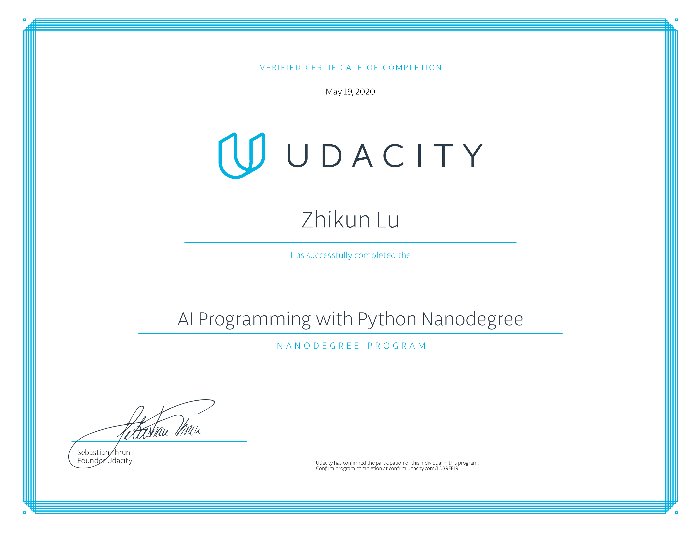

# Udacity-AI-Programming

Udacity AI Programming with Python Nanodegree Projects

There are two main projects for this program

1. Use a Pre-trained Image Classifier to Identify Dog Breeds
2. Create Your Own Image Classifier

Detailed descriptions to be added.

## Program Syllabus

### Part 1 Introduction to AI Programming

Welcome to the AI programming with python Nanodegree Program! Come and explore the beautiful world of AI.

Estimated time: 1 hour 7 minutes

### PART 2 Introduction to Python

Start coding with Python, drawing upon libraries and automation scripts to solve complex problems quickly.

- Project: Use a Pre-trained Image Classifier to Identify Dog Breeds

Estimated time: 29 days

### PART 3 Numpy, Pandas, Matplotlib

Let's focus on library packages for Python, such as : Numpy (which adds support for large data), Pandas (which is used for data manipulation and analysis) And Matplotlib (which is used for data visualization).

Estimated time: 7 hours 30 minutes

### PART 4 Linear Algebra Essentials

Learn the basics of the beautiful world of Linear Algebra and why it is such an important mathematical tool in the world of AI.

Estimated time: 9 hours

### PART 5 Calculus Essentials

Estimated time: 2 hours 30 minutes

### PART 6 Neural Networks

Estimated time: 9 hours 40 minutes

### PART 7 Create Your Own Image Classifier

In the second and final project for this course, you'll build a state-of-the-art image classification application.

- Project: Create Your Own Image Classifier

Estimated time: 46 days

### PART 8 Career Services

These Career Services will ensure you make meaningful connections with industry professionals to accelerate your career growth - whether looking for a job or opportunities to collaborate with your peers. Unlike your Nanodegree projects, you do not need to meet specifications on these Services to progress in your program. Submit these Career Services once, and get honest, personalized feedback and next steps from Udacity Career Coaches!

- Project: Improve Your LinkedIn Profile
- Project: Optimize Your GitHub Profile

Estimated time: 2 days